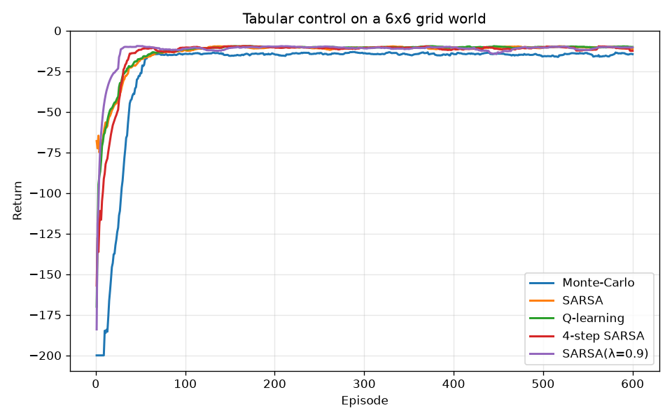

# rlkit — Monte-Carlo · TD · Offline RL · REINFORCE · A2C

A small, dependency-light reinforcement-learning library that implements and
**contrasts the canonical algorithm families** on shared environments — using
nothing heavier than **NumPy**. No Gym, no PyTorch, no TensorFlow. Every
update rule (including the policy-gradient backprop) is written out explicitly
so the maths stays readable.

| Family | Bootstraps? | Needs full episodes? | Learns a... | Class |
|---|---|---|---|---|
| **Monte-Carlo control** | no | yes | value function | `MonteCarloControl` |
| **TD control** | yes | no | value function | `Sarsa`, `QLearning` |
| **Reduced-bias TD** | yes | no | value function | `DoubleQLearning`, `ExpectedSarsa` |
| **n-step / λ TD** | partial | no | value function | `NStepSarsa`, `SarsaLambda` |
| **Offline / batch RL** | yes / no | no / yes | value function | `BatchQLearning`, `OffPolicyMonteCarlo` |
| **REINFORCE** | no | yes | policy | `Reinforce` |
| **A2C** | yes (critic) | no* | policy + value | `A2C` |

\* the A2C here uses Monte-Carlo returns as the critic target for clarity, but
bootstraps through the learned baseline.

The tabular agents run on grid worlds and on two **industrial environments** —
stochastic inventory control and predictive maintenance; the policy-gradient
agents additionally solve a continuous **CartPole** (both reach the max score
of 500) over the raw observation via a NumPy MLP.

Around the algorithms sit the parts a deployment needs and tutorials skip:
hyper-parameter **schedules**, a **replay buffer** (uniform and prioritised),
**offline learning** from logged data, **off-policy evaluation** with effective
sample size, policy evaluation **with confidence intervals**, pickle-free
**checkpointing**, and truncation-aware bootstrapping.



## Why it exists

Most tutorials show these algorithms in isolation, each with its own
environment and framework, and stop at the learning curve. `rlkit` puts every
agent behind one tiny Gym-like interface so you can run them head-to-head and
*see* the trade-offs: MC vs TD (episodic vs online), on-policy SARSA vs
off-policy Q-learning (safe vs optimal on the cliff), single vs double
Q-learning (optimism under noise), online vs offline learning, and value-based
vs policy-gradient methods — then evaluate the result the way you would have
to before deploying it.

## Install

```bash
git clone https://github.com/aabhimittal/td-learning-monte-carlo-sampling
cd td-learning-monte-carlo-sampling
pip install -e .            # only dependency is numpy
pip install -e ".[test]"   # + pytest, to run the suite
pip install -e ".[plot]"   # + matplotlib, for learning-curve figures
```

## Quickstart

```python
from rlkit.envs import GridWorld
from rlkit.algorithms import QLearning

env = GridWorld(rows=4, cols=4, goals=((3, 3),), step_reward=-1.0)
agent = QLearning(env.n_states, env.n_actions, gamma=1.0, alpha=0.5, epsilon=0.1, seed=0)
agent.train(env, episodes=800)

print(env.render_policy(agent.greedy_policy()))
# > > > v
# ^ > > v
# ^ ^ > v
# ^ ^ > G
```

Policy-gradient agents work over one-hot state features and the built-in
NumPy MLP:

```python
from rlkit.algorithms import A2C

agent = A2C(env.n_states, env.n_actions, hidden=(64,),
            actor_lr=0.02, critic_lr=0.05, entropy_coef=0.01, seed=0)
agent.train(env, episodes=1500)
policy = agent.greedy_policy(env.n_states, env.one_hot)
```

The same agents solve the continuous CartPole over its raw 4-D observation:

```python
from rlkit.envs import CartPole
from rlkit.algorithms import A2C

env = CartPole()
agent = A2C(env.n_features, env.n_actions, hidden=(64,),
            actor_lr=0.01, critic_lr=0.02, entropy_coef=0.01, seed=0)
agent.train(env, episodes=600, max_steps=500)
print(agent.evaluate(CartPole(seed=1)))   # -> 500.0 (the max score)
```

## Beyond the textbook: running this like a system

### Industrial environments

Grid worlds have deterministic ±1 rewards and a goal to reach. Operational
problems have stochastic money-denominated rewards, no goal state, and a
horizon — so `rlkit` ships two of them, each with an analytical baseline to
be measured against.

```python
from rlkit.algorithms import QLearning
from rlkit.envs import InventoryControl
from rlkit.evaluation import evaluate_policy
from rlkit.schedules import LinearSchedule

env = InventoryControl(capacity=10, demand_mean=3.0, horizon=30, seed=0)
agent = QLearning(env.n_states, env.n_actions, gamma=0.95, alpha=0.1,
                  epsilon=LinearSchedule(0.5, 0.05, decay_steps=2000), seed=0)
agent.train(env, episodes=4000, max_steps=30)

evaluate_policy(env, agent.greedy_policy(), episodes=500, max_steps=30)
# {'mean_return': 76.1, 'ci95': (74.4, 77.8), 'success_rate': 0.0, ...}
evaluate_policy(env, env.order_up_to_policy(3, 6), ...)   # the (s,S) baseline: 78.6
```

* **`InventoryControl`** — periodic-review replenishment under Poisson demand,
  with ordering, holding and shortage costs. Baseline: the classic `(s, S)`
  order-up-to rule.
* **`MachineMaintenance`** — run / service / replace a degrading machine with
  rare, expensive failures. Baseline: a wear-threshold rule. This is where
  Q-learning's maximisation bias is visible and `DoubleQLearning` earns its
  keep.

### Offline RL and off-policy evaluation

Most applied projects begin with a year of logs from an incumbent controller
and no permission to experiment on the real system.

```python
from rlkit.algorithms import BatchQLearning
from rlkit.buffers import collect_transitions
from rlkit.evaluation import off_policy_evaluation

buffer = collect_transitions(env, episodes=400, max_steps=60, seed=0)
agent = BatchQLearning(env.n_states, env.n_actions, gamma=0.99)
agent.fit(buffer, iterations=200)          # tabular fitted-Q iteration

agent.coverage()                            # 0.94 — how much of (s,a) the log covers
policy = agent.greedy_policy(min_count=1)   # stay inside the data's support

off_policy_evaluation(dataset, policy, gamma=0.95, method="wis")
# {'estimate': -2.85, 'ess': 11.0, 'overlap': 0.005, ...}
```

`ess` (effective sample size) and `overlap` are the honest part: a tight-looking
estimate resting on eleven trajectories is unproven, not good. `python
examples/offline_rl.py` walks the whole loop — log, fit offline, score
off-policy, then confirm against the true value.

### Schedules, buffers and checkpoints

```python
from rlkit.schedules import LinearSchedule, ExponentialSchedule

# Anywhere a float is accepted for alpha/epsilon, a schedule works too;
# it is advanced once per training episode.
agent = QLearning(n, a, alpha=ExponentialSchedule(0.5, 0.999, end=0.05),
                  epsilon=LinearSchedule(1.0, 0.05, decay_steps=500))

path = agent.save("checkpoints/agent")      # .npz, no pickle: loading runs no code
agent = QLearning.load(path, seed=7)
```

### Truncation is not termination

Environments report a time limit as `done=True` *plus* `info["truncated"]=True`.
Every TD agent bootstraps through truncations by default
(`bootstrap_on_truncation=True`), because a horizon is a property of your
training loop, not of the world. Treating one as terminal teaches an agent
with a 24-hour episode cap that the world ends every midnight — it is one of
the most common silent bugs in applied RL, and
`tests/test_edge_cases.py::test_truncation_is_bootstrapped_not_treated_as_terminal`
pins the difference.

## Examples

```bash
python examples/train_mc.py               # first-visit Monte-Carlo control
python examples/train_td.py               # SARSA vs Q-learning on the cliff
python examples/train_nstep.py            # 1-step vs n-step vs SARSA(λ)
python examples/train_policy_gradient.py  # REINFORCE vs A2C on a grid world
python examples/train_cartpole.py         # REINFORCE & A2C solve CartPole
python examples/compare_all.py            # all agents, one summary table
python examples/train_inventory.py        # inventory control vs the (s,S) baseline
python examples/offline_rl.py             # learn from logs, then validate off-policy
python examples/plot_learning_curves.py   # save docs/learning_curves.png (needs matplotlib)
```

`compare_all.py` output (optimal greedy return on this 4×4 task is **-5**):

```
Algorithm          Greedy return   (optimal = -5)
----------------------------------------------
Monte-Carlo                 -5.0
SARSA (TD)                  -5.0
Q-learning (TD)             -5.0
Expected SARSA              -5.0
Double Q-learning           -5.0
REINFORCE                   -5.0
A2C                         -5.0
```

## The algorithms

### Monte-Carlo control (`rlkit/algorithms/monte_carlo.py`)
First-visit MC: play a full episode, compute the discounted return following
the first visit to each `(state, action)`, and average those returns into
`Q`. Policy improvement is ε-greedy. No bootstrapping, no environment model —
just sampled returns.

### Temporal-difference control (`rlkit/algorithms/td.py`)
One-step TD updates `Q(s,a) ← Q(s,a) + α·[target − Q(s,a)]` after **every
step**. The two agents differ only in the target:

* **SARSA** (on-policy): `target = r + γ·Q(s', a')` — the value of the action
  actually taken next. It learns the value of the ε-greedy policy it follows,
  so on the cliff it prefers the *safe* path away from the edge.
* **Q-learning** (off-policy): `target = r + γ·max_a Q(s', a)` — the greedy
  next value. It learns the *optimal* cliff-edge path regardless of
  exploration.

`TDPrediction` implements plain TD(0) state-value estimation for a fixed
policy.

### Reduced-bias TD control (`rlkit/algorithms/double_q.py`)
`max_a Q(s',a)` is a biased estimate of the true max when the estimates are
noisy, so Q-learning systematically over-values whichever action got lucky —
the normal case when rewards are stochastic.

* **`DoubleQLearning`** keeps two tables: one *selects* the greedy next action,
  the other *evaluates* it, decoupling the two sources of noise.
* **`ExpectedSarsa`** replaces SARSA's sampled next action with the expectation
  under the behaviour policy, removing that variance for free. With
  `off_policy=True` it takes the expectation under the greedy policy and
  recovers Q-learning — both are special cases of one update.

### Offline / batch RL (`rlkit/algorithms/offline.py`)
* **`BatchQLearning`** — tabular fitted-Q iteration: sweep Bellman backups over
  a fixed dataset until the values stop moving. Reports `coverage()` and can
  restrict the extracted policy to well-supported actions.
* **`OffPolicyMonteCarlo`** — weighted importance sampling from episodes logged
  under a known behaviour policy, with weight clipping for stability and a
  pessimistic `init_value` for cost-shaped tasks (where zero-initialised
  unknowns would otherwise outrank everything the log contains).

### n-step and λ-returns (`rlkit/algorithms/td.py`)
Two ways to interpolate between one-step TD and Monte-Carlo:

* **`NStepSarsa`** accumulates `n` real rewards before bootstrapping off
  `Q[s_{t+n}, a_{t+n}]`. `n=1` is plain SARSA; large `n` approaches MC.
* **`SarsaLambda`** achieves the same interpolation *online* with accumulating
  eligibility traces: every visited `(s,a)` keeps a decaying trace and the TD
  error is broadcast to all of them. `λ=0` recovers one-step SARSA; `λ→1`
  (with `γ=1`) approaches MC. In practice it learns fastest on the grids here
  (see the plot above).

### REINFORCE (`rlkit/algorithms/reinforce.py`)
Monte-Carlo policy gradient. The policy is a softmax over a NumPy MLP. Using
the identity `d log π(a|s) / d logits = one_hot(a) − π`, the exact
score-function gradient is fed straight into the network's backward pass —
weighted by the (whitened) return. Optional entropy bonus.

### A2C (`rlkit/algorithms/a2c.py`)
Advantage Actor-Critic. A learned critic `V(s)` provides a state-dependent
baseline, so the actor is updated with the advantage `A_t = G_t − V(s_t)`
instead of the raw return — same expectation, far less variance. The critic
regresses toward the Monte-Carlo returns.

## Design

```
rlkit/
├── envs/          GridWorld · CliffWalking · CartPole · InventoryControl
│                  · MachineMaintenance   (Gym-like reset/step)
├── nn/            NumPy MLP with manual backprop + Adam
├── algorithms/    monte_carlo · td (SARSA/Q/n-step/λ) · double_q · offline
│                  · reinforce · a2c
├── schedules.py   constant / linear / exponential annealing
├── buffers.py     uniform + prioritised replay, dataset collection
├── evaluation.py  policy evaluation with CIs, off-policy evaluation, ESS
├── persistence.py pickle-free .npz checkpointing
├── validation.py  argument checks shared by agents, buffers and envs
└── utils.py       learning-curve smoothing, sparklines, matplotlib plotting
```

Environments share a common function-approximation interface — `env.features(obs)`
returns the feature vector (one-hot for grids, the raw 4-vector for CartPole) —
so the same `Reinforce`/`A2C` code runs on both discrete and continuous tasks.

The neural-net core (`rlkit/nn/mlp.py`) is a minimal reverse-mode stack:
`Linear`/`Tanh` layers implement `forward`/`backward`, the network accumulates
parameter gradients, and `Adam` consumes them. The policy-gradient algorithms
supply the upstream gradient directly, so there is no generic autograd to
trust — the learning signal is visible in ~10 lines per algorithm.

## Tests

```bash
pytest
```

The suite covers environment mechanics (walls, obstacles, goals, cliff resets,
truncation) and asserts that **every agent actually learns** a near-optimal
policy on a small grid.

On top of that, `tests/test_edge_cases.py` covers the cases that break agents
in production rather than in textbooks:

| Edge case | What it catches |
|---|---|
| Episode terminates on the first step | Update rules that assume a trajectory |
| Single-state / single-action MDP | `argmax` and shape assumptions |
| Goal walled off, no reachable terminal | Training that hangs or diverges |
| `alpha=0`, `gamma=0`, `epsilon` at 0 and 1 | Boundary hyper-parameters |
| Out-of-range or `nan` hyper-parameters | Silent misconfiguration |
| Rewards at `1e-8` and `1e6` | Overflow and precision loss |
| 2500-state table | Scale-dependent assumptions |
| Time-limit truncation | Bootstrapping through a horizon |
| Reward regime change mid-training | Constant α tracking vs. sample averaging |
| Same seed, twice | Reproducibility |
| Save → load → keep training | Checkpoint fidelity |

`tests/test_industrial_envs.py` holds the operational environments to their
analytical baselines, `tests/test_offline.py` covers batch learning and
off-policy evaluation (including "the log proves nothing" cases), and
`tests/test_schedules_buffers.py` covers buffer eviction, prioritised sampling
and schedule boundaries.

## License

MIT — see [LICENSE](LICENSE).
